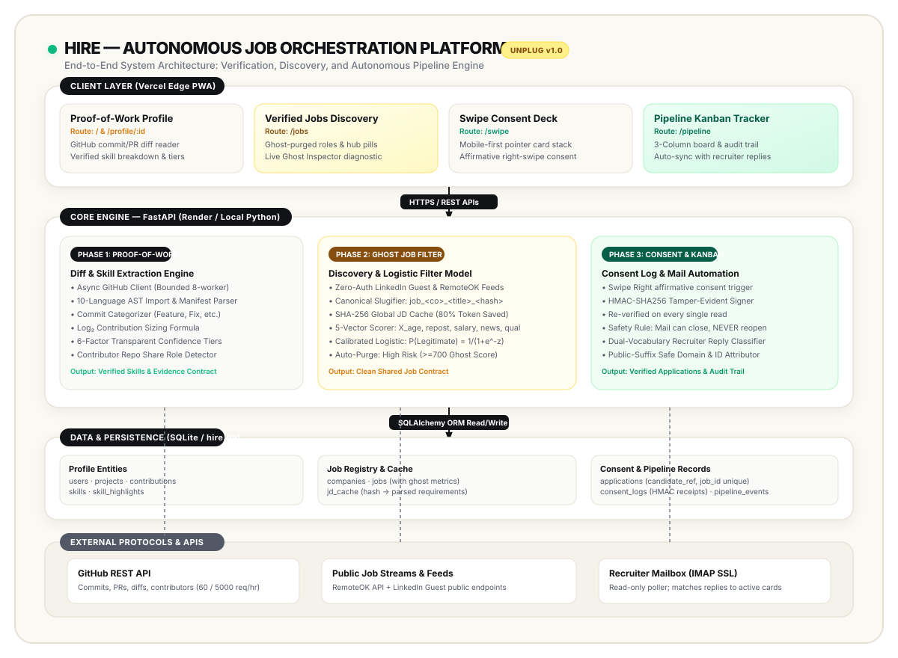
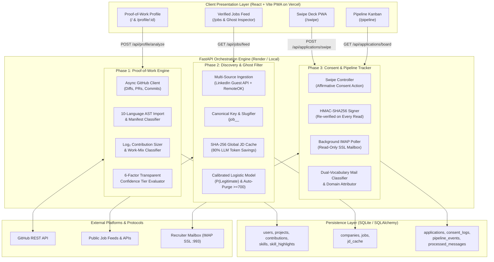

# HIRE — Autonomous Job Orchestration Platform

[](backend/tests)
[](https://frontend-sage-ten-51.vercel.app)
[](https://frontend-sage-ten-51.vercel.app)
[](backend/)

HIRE is an API-first, autonomous job orchestration ecosystem engineered to resolve off-campus tech hiring inefficiencies. Instead of brittle browser automation or keyword-stuffed resumes, HIRE operates across three protocol-level subsystems:
1. **Phase 1: GitHub "Proof-of-Work" (PoW) Engine** — Replaces unverifiable resume claims with evidence extracted from real commit diffs, AST imports, and merged PRs.
2. **Phase 2: Autonomous Job Discovery & Ghost Filter** — Ingests live openings (LinkedIn guest API & RemoteOK), deduplicates via collision-proof canonical keys, and purges phantom/compliance listings through a calibrated logistic legitimacy model.
3. **Phase 3: Swipe PWA & Consent Pipeline Tracker** — Deals verified listings as a mobile-first swipe deck, writes tamper-evident **HMAC-SHA256 consent receipts**, and autonomously tracks applications to interview or rejection via a read-only IMAP mailbox reader.

---

## 🏛️ System Architecture



### End-to-End System Flow (Mermaid)



---

## ⚙️ Core Subsystems

### 1. Phase 1: Proof-of-Work Engine (`backend/app/analysis/`, `profiles/`)
Every skill claim is backed by the developer's **own changed lines**: the files they touched, libraries they imported, and dependencies they added. No self-reported rankings, no opaque AI scoring.

- **Diff Parsing (`analysis/files.py`, `imports.py`):** Parses diffs across 10 language families (Python, TS/JS, Go, Rust, Java, etc.). Lockfiles (`package-lock.json`, `poetry.lock`) and vendored files are strictly ignored to prevent artificial inflation.
- **Log₂ Contribution Sizing (`analysis/contribution.py`):**
  $$\text{size} = \text{meaningful\_additions} + \frac{\text{meaningful\_deletions}}{2} + \frac{\text{other\_lines}}{4}$$
  $$\text{weight} = \log_2(1 + \text{size}) \times \text{type\_multiplier} \times (\text{2.0 if merged external PR}) \times (\text{0.1 if bulk})$$
- **6-Factor Confidence Tiers (`analysis/confidence.py`):** Substantial own code ($\ge 500$ lines), used across $\ge 2$ projects, accepted by others ($\ge 1$ merged external PR), sustained ($\ge 3$ months), recent ($\le 182$ days), built features. **Strong** ($\ge 4$ factors incl. code), **Moderate** ($\ge 3$ factors), or **Limited**.

### 2. Phase 2: Autonomous Job Discovery & NLP Ghost Filter (`backend/app/jobs/`)
Scores the probability that a listing represents genuine hiring intent and purges phantom postings before a candidate ever sees them.

- **Unauthenticated Ingestion (`jobs/ingestion/`):** Public LinkedIn `jobs-guest` zero-auth adapter + live RemoteOK API stream + Indian tech fixtures (Swiggy, Zepto, CRED, InnoSoft).
- **Collision-Proof Canonical Keys (`jobs/ingestion/canonical_key.py`):**
  $$\text{Key} = \text{job\_}\langle\text{company\_slug}\rangle\text{\_}\langle\text{title\_slug}\rangle\text{\_}\langle\text{hash}_{8}\rangle$$
- **Global JD Cache (`jobs/ingestion/hasher.py`):** SHA-256 normalized description hashing reuses parsed skills and experience levels, saving up to 80% downstream LLM tokens.
- **Calibrated Logistic Scoring (`jobs/ghost_filter/scorer.py`):**
  $$P(\text{Legitimate}) = \frac{1}{1 + e^{-z}}$$
  $$z = 0.85 - 2.75 X_{\text{age}} - 2.20 X_{\text{repost}} - 3.40 X_{\text{news}} + 1.60 X_{\text{salary}} + 2.10 X_{\text{quality}}$$
- **Score Bands:** Ghost Score = $\text{round}((1 - P(\text{Legitimate})) \times 999)$. Listings $\ge 700$ are **auto-purged** (`is_active = False`).

### 3. Phase 3: Swipe PWA & Consent Pipeline Tracker (`backend/app/applications/`, `mail/`)
Transforms job search into an affirmative consent loop with verifiable compliance.

- **Tamper-Evident Consent Receipts (`applications/consent.py`):** A swipe right mints an immutable receipt naming the candidate, employer, role, purpose, and UTC timestamp, signed with **HMAC-SHA256**. The signature is cryptographically re-verified on every API read.
- **Kanban Board & Safety Rules (`applications/board.py`):** Columns: `Applied` ➔ `Interview Scheduled` ➔ `Rejected`. Automated moves have strict guardrails: **the mail reader can close a card, but can NEVER reopen one**.
- **Dual-Vocabulary Recruiter Mail Classifier (`mail/classifier.py`):** Weighted phrase matching scores interview vs. rejection language separately. Handles multi-label public suffixes (`swiggy.co.in` vs `co.in`) to prevent incorrect employer attribution.

---

## 🎨 Linear-Inspired Minimalist UI

The frontend is built with **React 18 + TypeScript + Vite PWA**, styled with a **Linear-inspired minimalist aesthetic**:
- **Palette:** Warm oat / cream canvas (`#F7F5EE`), crisp card surfaces (`#FFFFFF`), solid obsidian black (`#121316`) pills, butter yellow accents (`#FEF08A`), and emerald green (`#10B981`) legitimacy indicators. **Strictly zero purple**.
- **Pill Navigation:** Top floating pill capsule bar matching Linear and modern tablet dashboards.
- **Live Ghost Inspector:** Interactive on-demand modal where candidates can paste any external job description and inspect real-time feature vector penalties.

---

## 🚀 Live Deployments

| Component | Platform | URL |
|---|---|---|
| **Frontend PWA** | **Vercel** | [**https://frontend-sage-ten-51.vercel.app**](https://frontend-sage-ten-51.vercel.app) |
| **Verified Jobs Feed** | **Vercel** | [**https://frontend-sage-ten-51.vercel.app/jobs**](https://frontend-sage-ten-51.vercel.app/jobs) |
| **Swipe Deck** | **Vercel** | [**https://frontend-sage-ten-51.vercel.app/swipe**](https://frontend-sage-ten-51.vercel.app/swipe) |
| **Pipeline Board** | **Vercel** | [**https://frontend-sage-ten-51.vercel.app/pipeline**](https://frontend-sage-ten-51.vercel.app/pipeline) |
| **Backend API Blueprint** | **Render** | Declarative [`render.yaml`](render.yaml) for 1-click deploy |

---

## 💻 Running Locally

### Backend (FastAPI + Python 3.11+)

```bash
cd backend
python3 -m venv .venv
source .venv/bin/activate    # On Windows: .venv\Scripts\Activate.ps1
pip install -r requirements.txt
uvicorn app.main:app --reload --port 8001
```
- API Docs (Swagger UI): `http://localhost:8001/docs`
- Run test suite: `pytest` (115/115 tests passing)

### Frontend (React + Vite + TypeScript)

```bash
cd frontend
npm install
VITE_API_PROXY="http://localhost:8001" npm run dev
```
- Open in browser: `http://localhost:5173`

---

## 📡 Recruiter Mailbox Setup (Optional)

To enable autonomous background email reading, configure in `backend/.env`:
```env
IMAP_ENABLED=true
IMAP_HOST=imap.gmail.com
IMAP_PORT=993
IMAP_USER=your-email@example.com
IMAP_PASSWORD=your-app-password
IMAP_POLL_SECONDS=300
```
*Note: The mailbox is accessed **read-only**; emails are never marked seen or deleted.* Without credentials, you can test replay via `POST /api/mail/sync` or the "Replay a recruiter reply" panel on the Pipeline board.

---

## 🧪 Test Suite

The test suite validates all three phases end-to-end:
```bash
cd backend && .venv/bin/pytest
# ================= 115 passed in 20.78s =================
```
- `test_commits.py`, `test_files.py`, `test_imports.py`, `test_skills_and_confidence.py` (Phase 1)
- `test_canonical_key.py`, `test_ghost_features.py`, `test_ghost_scorer.py`, `test_jd_cache.py`, `test_jobs_api.py`, `test_linkedin_adapter.py` (Phase 2)
- `test_applications_api.py`, `test_consent_log.py`, `test_imap_client.py`, `test_mail_classifier.py` (Phase 3)
